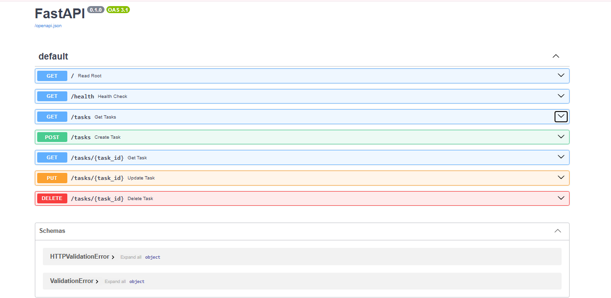

# Task API

A simple CRUD (Create, Read, Update, Delete) REST API for managing a to-do task list, built with Python and FastAPI. Data is stored in memory and resets when the server restarts.

## Technologies

- Python 3.12
- FastAPI
- Uvicorn

## How to Install

Clone the repository and install dependencies:

git clone https://github.com/MuhmmadBilalKhan/task-api.git
cd task-api
python -m venv venv
venv\Scripts\activate
pip install -r requirements.txt

## How to Run

uvicorn main:app --reload

The server will start at http://localhost:8000

## API Endpoints

| Method | Endpoint       | Purpose          |
|--------|----------------|------------------|
| GET    | /              | API information  |
| GET    | /health        | Health check     |
| GET    | /tasks         | List all tasks   |
| GET    | /tasks/{id}    | Get one task     |
| POST   | /tasks         | Create a task    |
| PUT    | /tasks/{id}    | Update a task    |
| DELETE | /tasks/{id}    | Delete a task    |

## Status Codes

| Code | Meaning     | When it's returned                          |
|------|-------------|----------------------------------------------|
| 200  | OK          | Successful GET, PUT                          |
| 201  | Created     | Successful POST                              |
| 204  | No Content  | Successful DELETE                            |
| 400  | Bad Request | Missing or invalid input (e.g. empty title)  |
| 404  | Not Found   | Task ID does not exist                       |

## Testing

Example using curl - creating a task:

curl -i -X POST http://localhost:8000/tasks -H "Content-Type: application/json" -d "{\"title\": \"Buy milk\"}"

Expected response:

HTTP/1.1 201 Created
{"id":4,"title":"Buy milk","done":false}

## Swagger UI

Interactive API documentation is available at:

http://localhost:8000/docs

This lets you test every endpoint directly from the browser.

