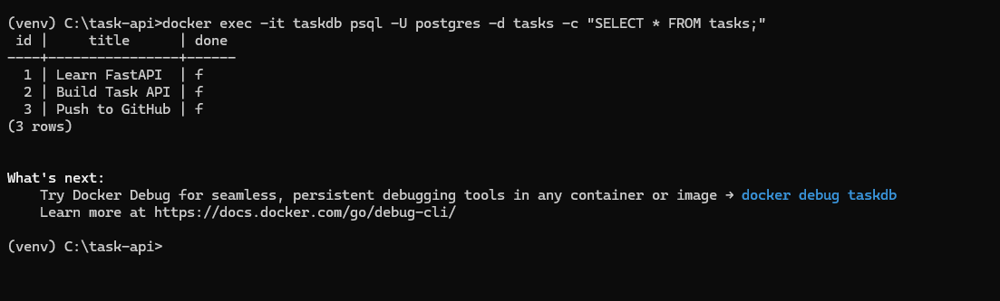

# Task API

A simple CRUD (Create, Read, Update, Delete) REST API for managing a to-do task list, built with Python and FastAPI. Tasks are stored in PostgreSQL, running in a Docker container, and survive both app restarts and full stack restarts.

## Technologies

- Python 3.12
- FastAPI
- Uvicorn
- PostgreSQL 16 (via Docker)
- psycopg (Postgres driver)
- Docker & Docker Compose

## How to Run (recommended - one command)

This project uses Docker Compose to start the API and its database together.

1. Install [Docker Desktop](https://www.docker.com/products/docker-desktop/).
2. Clone the repository:

```
git clone https://github.com/MuhmmadBilalKhan/task-api.git
cd task-api
```

3. Copy the example environment file:

```
copy .env.example .env
```

4. Start everything with one command:

```
docker compose up
```

This builds the API image, starts a PostgreSQL 16 container with a persistent volume, waits for the database to be healthy, then starts the API. On first run it automatically creates the `tasks` table and seeds 3 example tasks.

The API is then available at http://localhost:8000

To stop everything:

```
docker compose down
```

Your data survives this - `docker compose down` followed by `docker compose up` again will show the same tasks, because the database's data lives in a named Docker volume (`taskdata`), not inside the container itself.

## Alternative: run locally without Docker

If you'd rather run the API directly on your machine against a database you manage yourself:

```
python -m venv venv
venv\Scripts\activate
pip install -r requirements.txt
```

Set `DATABASE_URL` in a `.env` file (see `.env.example`) pointing at any reachable PostgreSQL instance, then:

```
uvicorn main:app --reload
```

## API Endpoints

| Method | Endpoint       | Purpose          |
|--------|----------------|------------------|
| GET    | /              | API information  |
| GET    | /health        | Health check     |
| GET    | /tasks         | List all tasks   |
| GET    | /tasks/{id}    | Get one task     |
| POST   | /tasks         | Create a task    |
| PUT    | /tasks/{id}    | Update a task    |
| DELETE | /tasks/{id}    | Delete a task    |

## Status Codes

| Code | Meaning     | When it's returned                          |
|------|-------------|----------------------------------------------|
| 200  | OK          | Successful GET, PUT                          |
| 201  | Created     | Successful POST                              |
| 204  | No Content  | Successful DELETE                            |
| 400  | Bad Request | Missing or invalid input (e.g. empty title)  |
| 404  | Not Found   | Task ID does not exist                       |

## Testing

Example using curl - creating a task:

```
curl -i -X POST http://localhost:8000/tasks -H "Content-Type: application/json" -d "{\"title\": \"Buy milk\"}"
```

Expected response:

```
HTTP/1.1 201 Created
{"id":4,"title":"Buy milk","done":false}
```

## Swagger UI

Interactive API documentation is available at:

```
http://localhost:8000/docs
```

This lets you test every endpoint directly from the browser.


## Architecture: the Repository Pattern

All database code lives in a single file, `task_repository.py`. Routes in `main.py` never contain SQL directly - they call repository functions like `get_all_tasks()`, `insert_task(title)`, and `update_task_row(task_id, title, done)`, which return plain Python data (dicts, `None`, or booleans), never raw database rows or driver-specific objects.

This is why moving from SQLite (Assignment 2) to PostgreSQL (this assignment) required editing only `task_repository.py` - the connection setup, the SQL placeholder syntax (`?` became `%s`), and how the newly-created row's id was retrieved (`cursor.lastrowid` became `RETURNING id`). Every route in `main.py`, every status code, and every validation rule stayed completely unchanged.

## Database: PostgreSQL in Docker

### Why Docker + PostgreSQL

PostgreSQL is a real database server - the same kind of engine used by most production backends - rather than a single file like SQLite. Running it in a Docker container means no manual installation, no version conflicts with other projects, and a setup that behaves identically on any machine. A named volume (`taskdata`) keeps the data on disk outside the container, so removing or rebuilding the container never loses data.

### Configuration

The database connection string lives in `.env` (git-ignored, never committed) as `DATABASE_URL`. A committed `.env.example` shows the same keys with the same local-development values, since this project uses a throwaway development password (`dev`) rather than a real secret.

### Schema

| Column | Type    | Notes                                    |
|--------|---------|-------------------------------------------|
| id     | SERIAL  | Primary key, auto-incremented by Postgres |
| title  | TEXT    | Required, cannot be empty                 |
| done   | BOOLEAN | Defaults to false                         |

### Proving persistence

I created a task, then ran `docker compose down` (destroying both containers) followed by `docker compose up` (recreating them from scratch). The task was still present in `GET /tasks` afterward, proving the named volume - not the containers themselves - is what keeps the data alive.

I also verified the database directly using `psql` inside the container:

```
docker exec -it taskdb psql -U postgres -d tasks -c "SELECT * FROM tasks;"
```



## Extras (Optional)

These endpoints go beyond the core CRUD requirement:

| Method | Endpoint                          | Purpose                                    |
|--------|------------------------------------|---------------------------------------------|
| GET    | /tasks/filter?done=true            | Filter tasks by completion status          |
| GET    | /tasks/filter?search=milk          | Search tasks by title (case-insensitive)   |
| GET    | /stats                             | Get total, done, and open task counts      |
| POST   | /reset                             | Restore the 3 example tasks                |
| GET    | /tasks/page?limit=2&offset=1       | Return a paginated slice of tasks          |

Note: these extras still use the original in-memory list from Assignment 1 and have not yet been migrated to the database.

## The Mortality Experiment (Assignment 1)

In Assignment 1, tasks were stored in a plain Python list, which reset every time the server restarted. This was intentional, to demonstrate the limitation of in-memory storage before introducing real persistence in later assignments.

## AI vs Me (Stage 7 - AI Rematch, Assignment 1)

I built this API by hand first, then wrote a prompt asking an AI assistant to build the same project from scratch, without copying text from the assignment document. The AI's version lives in the `ai-version/` folder and my hand-built version was left untouched.

### My first prompt

> As an backend AI engineer want to build firt CRUD(create, read, update, delete) API. Use Python Language and FastApi with Swagger UI to test all endpoints throug web interface. API must have endpoints /, /health, get/, put/, update/, delete/. Every endpoendpoints return status code aaccordingly to check spcefic answer. 200,201,204,400,404 also validate each step through ui. Donot use any database just use in_memory storage. Push all code to github with every step commit almost minumum 7 commits. At last evaluate each endpoints through swager ui.

This prompt was vague about the resource itself: it never said "task," never described what fields a task has, never mentioned POST/create at all, and listed both "put/" and "update/" as if they were two different endpoints. The AI had to guess: it invented a generic `/items` resource with just a `name` field, and added a POST endpoint on its own initiative since CRUD is incomplete without one.

### My improved prompt

> I have already completed my CRUD API project manually. Now I want you to create an AI version of the same project so I can compare it with my own version. Use Python and FastAPI. The project should be a simple To-Do Task API where I can create, read, update and delete tasks. Each task should have: id, title, done. Keep the tasks in memory using a Python list. Don't use any database or file storage. [full endpoint list with exact methods, status codes, and validation rules specified]

This version named the resource, defined the task's fields, spelled out every endpoint with its exact HTTP method and status codes, and stated the validation rule explicitly. The result was much closer to my own version - correct resource name, correct fields, correct status codes on the first try.

### What the AI did better

The AI's PUT endpoint only updates the fields actually present in the request body, leaving the rest untouched. My own PUT always requires both `title` and `done` and silently resets `done` to `false` if it's missing from the body - which means my version can accidentally undo a task being marked done if the client forgets to include it. The AI's partial-update approach is arguably safer.

### What it got wrong or quietly changed

The AI's 404 error messages are generic ("Task not found") instead of including the task ID like mine does ("Task 5 not found"). Neither prompt specified the exact wording of the error message, so this was a small but real quality difference between the two versions.

### What my first prompt failed to specify

I never mentioned the word "task," never described the task's fields, and never explicitly asked for a POST/create endpoint even though I want full CRUD. The AI silently invented a generic `/items` resource with a single `name` field and added the create endpoint on its own, since it correctly guessed that CRUD is meaningless without a Create step - but it had no way of knowing I actually wanted `/tasks` with `title` and `done` fields, because I never said so.

### What I changed in the second prompt

I named the exact resource (`/tasks`), defined the exact task fields (`id`, `title`, `done`), listed every endpoint with its exact HTTP method, and stated the precise status code and validation rule for each case. This produced a version functionally almost identical to my hand-built API on the first try - proving that AI output quality depends directly on how precisely the request is specified.
