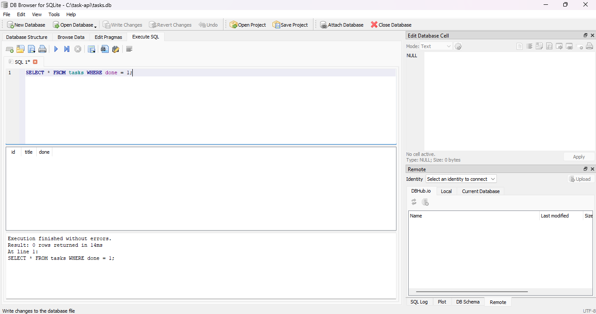

# Task API

A simple CRUD (Create, Read, Update, Delete) REST API for managing a to-do task list, built with Python and FastAPI. Tasks are stored in a SQLite database and survive server restarts.

## Technologies

- Python 3.12
- FastAPI
- Uvicorn
- SQLite (via Python's built-in `sqlite3` module)

## How to Install

Clone the repository and install dependencies:

```
git clone https://github.com/MuhmmadBilalKhan/task-api.git
cd task-api
python -m venv venv
venv\Scripts\activate
pip install -r requirements.txt
```

## How to Run

```
uvicorn main:app --reload
```

The server will start at http://localhost:8000

On first run, this automatically creates a `tasks.db` file with a `tasks` table and seeds 3 example tasks. Restarting the server does not duplicate the seed data or create a second database.

## API Endpoints

| Method | Endpoint       | Purpose          |
|--------|----------------|------------------|
| GET    | /              | API information  |
| GET    | /health        | Health check     |
| GET    | /tasks         | List all tasks   |
| GET    | /tasks/{id}    | Get one task     |
| POST   | /tasks         | Create a task    |
| PUT    | /tasks/{id}    | Update a task    |
| DELETE | /tasks/{id}    | Delete a task    |

## Status Codes

| Code | Meaning     | When it's returned                          |
|------|-------------|----------------------------------------------|
| 200  | OK          | Successful GET, PUT                          |
| 201  | Created     | Successful POST                              |
| 204  | No Content  | Successful DELETE                            |
| 400  | Bad Request | Missing or invalid input (e.g. empty title)  |
| 404  | Not Found   | Task ID does not exist                       |

## Testing

Example using curl - creating a task:

```
curl -i -X POST http://localhost:8000/tasks -H "Content-Type: application/json" -d "{\"title\": \"Buy milk\"}"
```

Expected response:

```
HTTP/1.1 201 Created
{"id":4,"title":"Buy milk","done":false}
```

## Swagger UI

Interactive API documentation is available at:

```
http://localhost:8000/docs
```

This lets you test every endpoint directly from the browser.


## Database (SQLite)

### Why SQLite

SQLite was chosen because it needs no separate database server, no installation, and no configuration - the entire database is a single file (`tasks.db`) that Python's built-in `sqlite3` module can create and use directly. This makes it ideal for a small project like this one, where the goal is to learn persistence without adding infrastructure overhead. For a larger, multi-user production system, a server-based database like PostgreSQL would be a more appropriate next step.

### Where the database lives

The database is stored in `tasks.db`, in the root of the project folder. It is created automatically the first time the server starts - if the file or the `tasks` table doesn't exist yet, the app creates both, then seeds 3 example tasks only if the table is empty. `tasks.db` is listed in `.gitignore` and is not committed to the repository, so every fresh clone starts with a clean, freshly-seeded database rather than inheriting someone else's data.

### Schema

The `tasks` table has three columns:

| Column | Type    | Notes                          |
|--------|---------|----------------------------------|
| id     | INTEGER | Primary key, auto-incremented by SQLite |
| title  | TEXT    | Required, cannot be empty       |
| done   | BOOLEAN | Stored as 0/1, defaults to 0     |

### Exploring the database by hand

I opened `tasks.db` in [DB Browser for SQLite](https://sqlitebrowser.org/) and ran several queries directly against it, including:

```sql
SELECT * FROM tasks WHERE done = 1;
```

This returned 0 rows on a freshly seeded database, since none of the 3 example tasks are marked done by default.



I also ran `UPDATE tasks SET done = 1;` directly in DB Browser (with no server restart), then called `GET /tasks` through the API and saw every task immediately show `"done": true` - confirming the API and DB Browser read and write the exact same file, with no syncing step involved.

## Extras (Optional)

These endpoints go beyond the core CRUD requirement:

| Method | Endpoint                          | Purpose                                    |
|--------|------------------------------------|---------------------------------------------|
| GET    | /tasks/filter?done=true            | Filter tasks by completion status          |
| GET    | /tasks/filter?search=milk          | Search tasks by title (case-insensitive)   |
| GET    | /stats                             | Get total, done, and open task counts      |
| POST   | /reset                             | Restore the 3 example tasks                |
| GET    | /tasks/page?limit=2&offset=1       | Return a paginated slice of tasks          |

Example:

```
curl -i http://localhost:8000/stats
```

```
HTTP/1.1 200 OK
{"total":3,"done":0,"open":3}
```

Note: these extras still use the original in-memory list from Assignment 1 and have not yet been migrated to SQL.

## The Mortality Experiment (Assignment 1)

In Assignment 1, I created a new task with POST, confirmed it existed with GET /tasks, then restarted the server. The new task was gone - only the original 3 seed tasks remained, because the task list was a plain Python variable held in the server's memory, not saved to disk. This assignment (A2) fixes that limitation by moving storage to SQLite, where data now survives a restart.

## AI vs Me (Stage 7 - AI Rematch, Assignment 1)

I built this API by hand first, then wrote a prompt asking an AI assistant to build the same project from scratch, without copying text from the assignment document. The AI's version lives in the `ai-version/` folder and my hand-built version was left untouched.

### My first prompt

> As an backend AI engineer want to build firt CRUD(create, read, update, delete) API. Use Python Language and FastApi with Swagger UI to test all endpoints throug web interface. API must have endpoints /, /health, get/, put/, update/, delete/. Every endpoendpoints return status code aaccordingly to check spcefic answer. 200,201,204,400,404 also validate each step through ui. Donot use any database just use in_memory storage. Push all code to github with every step commit almost minumum 7 commits. At last evaluate each endpoints through swager ui.

This prompt was vague about the resource itself: it never said "task," never described what fields a task has, never mentioned POST/create at all, and listed both "put/" and "update/" as if they were two different endpoints. The AI had to guess: it invented a generic `/items` resource with just a `name` field, and added a POST endpoint on its own initiative since CRUD is incomplete without one.

### My improved prompt

> I have already completed my CRUD API project manually. Now I want you to create an AI version of the same project so I can compare it with my own version. Use Python and FastAPI. The project should be a simple To-Do Task API where I can create, read, update and delete tasks. Each task should have: id, title, done. Keep the tasks in memory using a Python list. Don't use any database or file storage. [full endpoint list with exact methods, status codes, and validation rules specified]

This version named the resource, defined the task's fields, spelled out every endpoint with its exact HTTP method and status codes, and stated the validation rule explicitly. The result was much closer to my own version - correct resource name, correct fields, correct status codes on the first try.

### What the AI did better

The AI's PUT endpoint only updates the fields actually present in the request body, leaving the rest untouched. My own PUT always requires both `title` and `done` and silently resets `done` to `false` if it's missing from the body - which means my version can accidentally undo a task being marked done if the client forgets to include it. The AI's partial-update approach is arguably safer.

### What it got wrong or quietly changed

The AI's 404 error messages are generic ("Task not found") instead of including the task ID like mine does ("Task 5 not found"). Neither prompt specified the exact wording of the error message, so this was a small but real quality difference between the two versions.

### What my first prompt failed to specify

I never mentioned the word "task," never described the task's fields, and never explicitly asked for a POST/create endpoint even though I want full CRUD. The AI silently invented a generic `/items` resource with a single `name` field and added the create endpoint on its own, since it correctly guessed that CRUD is meaningless without a Create step - but it had no way of knowing I actually wanted `/tasks` with `title` and `done` fields, because I never said so.

### What I changed in the second prompt

I named the exact resource (`/tasks`), defined the exact task fields (`id`, `title`, `done`), listed every endpoint with its exact HTTP method, and stated the precise status code and validation rule for each case. This produced a version functionally almost identical to my hand-built API on the first try - proving that AI output quality depends directly on how precisely the request is specified.
